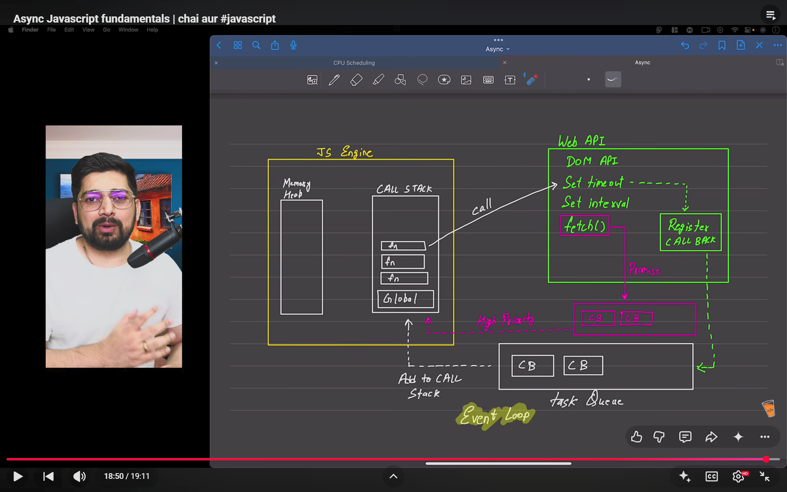
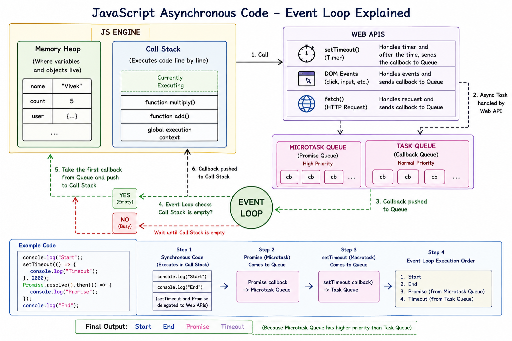

# JavaScript Async Code & Event Loop Notes

> **Revision Goal:** Is note ko future me padhkar JavaScript asynchronous code ka complete flow dobara samajh aa jaye.

---

# 1. JavaScript by Default

JavaScript ka normal code **synchronous** hota hai aur JavaScript execution ek time par ek main execution flow me hota hai.

**Synchronous ka simple meaning:**

> Pehle wala kaam complete hoga, tabhi next kaam execute hoga.

```js
console.log("1");
console.log("2");
console.log("3");
```

Output:

```text
1
2
3
```

---

# 2. JS Engine

JavaScript Engine ko is diagram me do important parts me dikhaya gaya hai:

- **Memory Heap** → Variables aur objects ke liye memory.
- **Call Stack** → Functions aur synchronous code execute hone ki jagah.

## Generated Diagram





---

# 3. Problem: Async Kaam

Kuch kaam time le sakte hain, jaise:

- Timer (`setTimeout`)
- User events (`click`)
- Network request (`fetch`)

Agar JavaScript Call Stack in kaamon ka wait karta rahe, to baaki program ruk sakta hai.

Isliye JavaScript runtime environment kuch kaam **Web APIs** ko delegate kar deta hai.

---

# 4. Web APIs

Browser hume kuch APIs provide karta hai jo JavaScript Engine ka direct part nahi hoti.

Examples:

- `setTimeout()`
- `setInterval()`
- DOM Events
- `fetch()`

### Simple idea:

> JavaScript kehta hai: **"Tum ye time-consuming kaam handle karo, complete hone par mujhe callback bhej dena."**

---

# 5. Task Queue (Callback Queue)

Jab normal async kaam complete hota hai, uska callback directly Call Stack me nahi jaata.

Woh pehle **Task Queue** me wait karta hai.

Examples:

- `setTimeout` callback
- DOM event callback

Queue ko ek line ki tarah samjho: callbacks execution ke liye wait karte hain.

---

# 6. Microtask / Promise Queue

Promises ke callbacks ek alag queue me aate hain jise generally **Microtask Queue** ya **Promise Queue** kehte hain.

Is queue ki priority normal Task Queue se zyada hoti hai.

### Important Priority

```text
Synchronous Code
       ↓
Microtask / Promise Queue
       ↓
Task / Callback Queue
```

---

# 7. Event Loop ⭐

**Event Loop** asynchronous JavaScript flow ka important coordinator hai.

Iska simple kaam:

1. Check karo kya **Call Stack empty** hai.
2. Agar empty nahi hai → wait karo.
3. Agar empty hai → pehle Microtask Queue ke callbacks execute karne ka chance milta hai.
4. Phir normal Task Queue ke callbacks Call Stack me bheje jaate hain.

### Golden Flow

```text
Call Stack → Web API → Queue → Event Loop → Call Stack
```

---

# 8. `setTimeout()` Example

```js
console.log("Start");

setTimeout(() => {
    console.log("Hello");
}, 2000);

console.log("End");
```

### Step-by-step

**Step 1:** `Start` Call Stack me execute hota hai.

**Step 2:** `setTimeout()` browser ki Web API ko delegate hota hai.

**Step 3:** JavaScript wait nahi karta aur next line execute karta hai.

**Step 4:** `End` print hota hai.

**Step 5:** 2 seconds complete hone ke baad callback Task Queue me aata hai.

**Step 6:** Event Loop Call Stack empty milne par callback ko Call Stack me bhejta hai.

### Output

```text
Start
End
Hello
```

---

# 9. `setTimeout(..., 0)` Immediately Execute Nahi Hota

```js
console.log("1");

setTimeout(() => {
    console.log("2");
}, 0);

console.log("3");
```

Output:

```text
1
3
2
```

### Why?

`setTimeout` ka callback pehle Web API aur Task Queue ke flow se guzarta hai. Isliye synchronous code pehle complete hota hai.

> **0 milliseconds ka matlab "Call Stack ke beech me immediately execute karo" nahi hota.**

---

# 10. Promise vs setTimeout

```js
console.log("Start");

setTimeout(() => {
    console.log("Timeout");
}, 0);

Promise.resolve().then(() => {
    console.log("Promise");
});

console.log("End");
```

Output:

```text
Start
End
Promise
Timeout
```

### Reason

1. Synchronous code pehle → `Start`, `End`
2. Promise callback → Microtask Queue (higher priority)
3. `setTimeout` callback → Task Queue

---

# 11. Video Diagram Screenshot

Neeche wala diagram same overall architecture ko visual form me dikhata hai.


---

# 12. Blocking vs Non-Blocking Code

## Blocking Code

Aisa code jisme program ko kisi kaam ke complete hone ka wait karna padta hai.

```text
Kaam 1 complete → tab Kaam 2
```

## Non-Blocking Code

Time-consuming kaam ko delegate karke program baaki kaam continue kar sakta hai.

```text
Async kaam delegate
        ↓
Baaki code execute
        ↓
Async result baad me handle
```

### Important

Har situation me non-blocking approach automatically best nahi hoti. Agar next step previous operation ke successful completion par depend karta hai, to result ka wait karna zaroori hota hai.

---

# 🎯 Final Revision Summary

## JavaScript Async Flow

```text
1. JavaScript synchronous code Call Stack me execute karta hai.
2. Async operation Web API / runtime environment ko diya ja sakta hai.
3. Operation complete hone par callback Queue me wait karta hai.
4. Event Loop Call Stack empty hone ka wait karta hai.
5. Callback Call Stack me aata hai aur execute hota hai.
```

## Priority Rule

```text
Call Stack (current synchronous code)
        ↓
Microtask Queue (Promises)
        ↓
Task Queue (setTimeout, events, etc.)
```

## One-Line Memory Trick 🧠

> **JS khud ek-ek kaam karta hai, async kaam environment ko delegate karta hai, aur Event Loop callback ko sahi time par wapas Call Stack me lata hai.**
